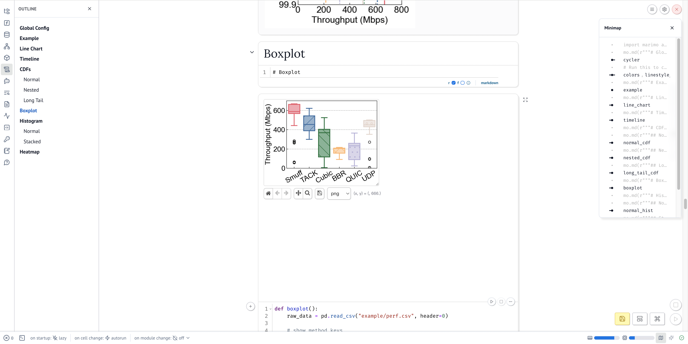
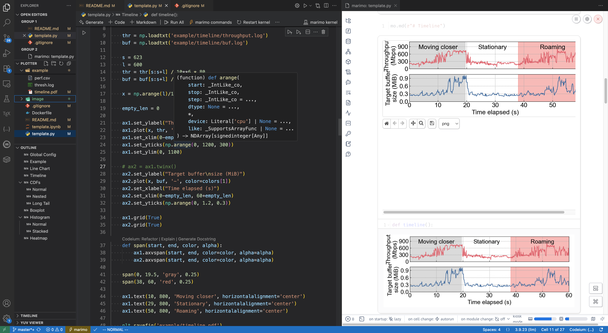

# Plotter for CS Conference Papers

## Background & Motivation

We aim to create aesthetically pleasing graphs for our research papers, and while attempting to achieve this, we have encountered several challenges with gnuplot. These issues include:

1. **Limited Community Support:** Gnuplot suffers from a dwindling community of contributors and developers. This makes it challenging to swiftly find solutions to problems online.

2. **Lack of Essential Functionalities:** Gnuplot lacks certain fundamental features, such as the ability to simultaneously apply fill colors and markers in a histogram plot, which can be frustrating and unacceptable.

3. **Inadequate Data Processing Capabilities:** Gnuplot's limitations extend to its inability to perform certain data processing tasks, limiting its overall flexibility in data visualization.

As a solution to these challenges, we introduce our custom plotter, which is built upon JupyterLab, matplotlib, numpy, and pandas. This alternative not only enhances the visual appeal of our graphs but also simplifies the process and accelerates our graph creation workflow.

## Usage 1: Jupyter Notebook (Deprecated)

Previously we use Jupyter Notebooks to maintain all plotting scripts in a single `.ipynb` file. However, Jupyter Notebooks come with two limitations during our practice: 1) it is not easy to share notebooks with others, as it updates cell metadata on each run, thus is not git-friendly; 2) It is not consistent across cells, i.e., each cell has its own variable scope and can easily affect other cells without being aware of it. We recommend using a more advanced Python notebook [Marimo](https://docs.marimo.io/).

### Docker Container

We provide a Dockerfile for creating a self-contained and portable environment for all functionalities. Simply run `docker build -t <tag> .` to build the image and `docker run -d -p 8888:8888 --name <name> <tag>` to run the container. The plotter environment can be accessed through `http://localhost:8888`


### Local Installation

VSCode provides powerful Jupyter Notebook support, simply install [Jupyter Extension Package](https://marketplace.visualstudio.com/items?itemName=ms-toolsai.jupyter) and select the correct python3 kernel to launch the notebook.

## Usage 2: Marimo (Recommended)

[Marimo](https://docs.marimo.io/) provides more powerful and git-friendly Python notebook. All plotting scripts are stored in a single `.py` file and Marimo interprets it into an interactive notebook.

### Web App

Web app is created by Marimo CLI:

```
pip install marimo
marimo edit template.py
```



### Local Installation

Marimo provides a VSCode extension, simply install [Marimo Extension](https://marketplace.visualstudio.com/items?itemName=marimo-team.vscode-marimo) and select the correct python3 kernel to launch the notebook.



## Template

We have developed a straightforward plotting template `template.ipynb` and `template.py` including commonly used graph types in conference papers. This template serves as a versatile tool for researchers aiming to visualize their data effectively. Please feel free to add more skeleton codes!